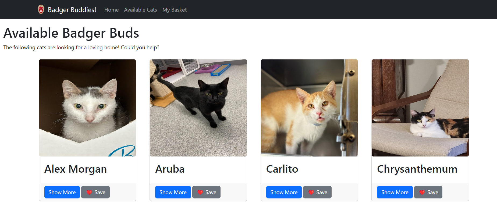
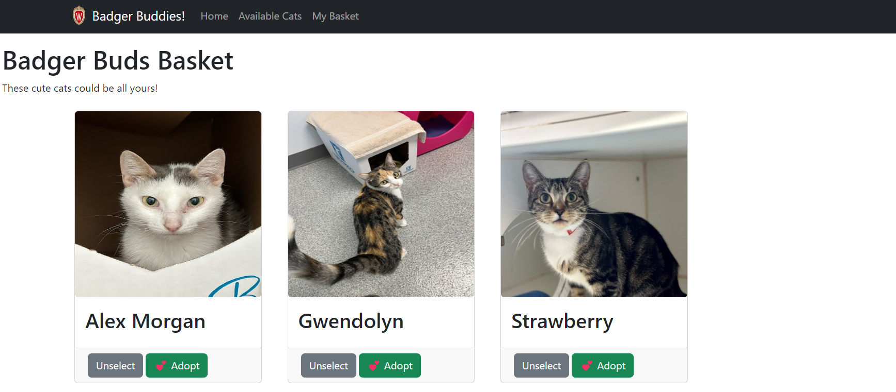
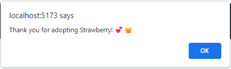

# Cat Adoption WebApp Prototype
A course project to create a web application prototype for a cat adoption center using JavaScript and React, which allows people to place cats into the wish-list (basket) and adopt them with instant and consistent data updates.

To run the website, type the following in terminal
```
npm install
npm run dev
```
and then open `localhost:5173` in the browser.






